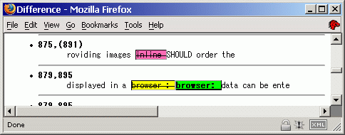
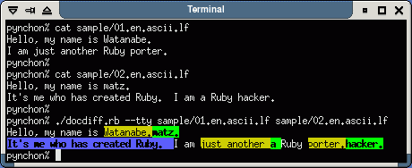

# DocDiff

* English | [Japanese](README_ja.md)

(C) 2000 Hisashi MORITA

## Description

Compares two text files by word, by character, or by line

## Screenshots

<div style="display: grid; grid-template-columns: 1fr 1fr;">

<p>HTML output<br />
</p>

<p>HTML output (digest)<br />
</p>

<p>tty output<br />
</p>

<p>tty output (comparing Japanese text)<br />
</p>

<p>tty output<br />
</p>

<p>tty output (comparing Japanese text)<br />
</p>

</div>

<p>Comparing English text (codepage 437) on Windows (Cygwin)<br />
</p>

<p>Comparing Japanese text (codepage 932) on Windows (Cygwin)<br />
</p>

<p>You can compare text files by line, word, or character (format: tty)<br/>
</p>

(Screenshots as of version 0.3.2.)

## Summary

DocDiff compares two text files and shows the difference. It can compare files word by word, character by character, or line by line. It has several output formats such as HTML, tty, Manued, or user-defined markup.

It supports several encodings and end-of-line characters, including ASCII (and other single byte encodings such as ISO-8859-*), UTF-8, EUC-JP, Shift_JIS (Windows-31J), CR, LF, and CRLF.

## Usage

### Synopsis

```
$ docdiff [options] oldfile newfile
```

e.g.

```
$ docdiff old.txt new.txt > diff.html
```

See the help message for detail (`docdiff --help`).

### Example

<pre>
$ cat 01_en_ascii_lf.txt
Hello, my name is Watanabe.
I am just another Ruby porter.
$ cat 02_en_ascii_lf.txt
Hello, my name is matz.
It's me who has created Ruby.  I am a Ruby hacker.
$ docdiff --tty 01_en_ascii_lf.txt 02_en_ascii_lf.txt
Hello, my name is <span class="before-change" style="background: yellow; border: thin inset;"><del>Watanabe.</del></span><span class="after-change" style="background: lime; font-weight: bolder; border: thin outset;"><ins>matz.</ins></span>
<span class="add" style="background: deepskyblue; font-weight: bolder; border: thin outset;"><ins>It's me who has created Ruby.&nbsp;&nbsp;</ins></span>I am <span class="before-change" style="background: yellow; border: thin inset;"><del>just another </del></span><span class="after-change" style="background: lime; font-weight: bolder; border: thin outset;"><ins>a </ins></span>Ruby <span class="before-change" style="background: yellow; border: thin inset;"><del>porter.</del></span><span class="after-change" style="background: lime; font-weight: bolder; border: thin outset;"><ins>hacker.</ins></span>
$
</pre>

## Requirements

* Runtime requirements:
  - [Ruby](https://www.ruby-lang.org/) (>= 3.0)
* Development requirements:
  - [Test::Unit](https://test-unit.github.io/)
  - Make ([GNU Make](https://www.gnu.org/software/make/))
  - [Git](https://git-scm.com/)
  - [md2html](https://github.com/mity/md4c) (for generating documents)
  - [Rake](https://ruby.github.io/rake/) (optional)
  - sed, gzip, tar, etc.

## Installation

Several operating environments have a packaged version of DocDiff available. If this applies to you, installing DocDiff via these packages is probably the easiest option.

### Debian Package

Site-wide installation:

```
$ sudo apt update
$ sudo apt install docdiff
```

### Gem Package

If you are familiar with the Ruby programming language, you may prefer to install DocDiff as a gem package.

User-wide installation from [RubyGems.org](https://rubygems.org/):

```
$ gem install docdiff
```

User-wide installation from local build:

```
$ rake build
$ gem install pkg/docdiff-X.Y.Z.gem
```

(Note that you have to set the `PATH` environment variable correctly to run applications that are installed as gems. Environment management tools for Ruby such as [rbenv](https://github.com/rbenv/rbenv) may come in handy.)

### Installation from Source Using Make

If you really have to install DocDiff from source using Make, test it carefully before proceeding.

Test installation in `tmp` directory:

```
$ mkdir tmp
$ make install DESTDIR=tmp PREFIX=/local
$ tree tmp || la -lR tmp
```

User-wide installation example (not recommended though, as this may overwrite files and mess up your directory structure):

```
$ make install DESTDIR=~ PREFIX=/local
```

## Configuration

You can place configuration files at:

* `/etc/docdiff/docdiff.conf` (site-wide configuration)

* `~/.config/docdiff/docdiff.conf` (user configuration) (see [`$XDG_CONFIG_HOME`](https://specifications.freedesktop.org/basedir/0.8/))

  (Warning: You are discouraged from using either `~/etc/docdiff/docdiff.conf` or `~/.docdiff/docdiff.conf`, both of which are deprecated though they are still effective for backward compatibility at the moment. Also note that multiple user configuration files cannot coexist at the same time.)

Notation is as follows (also refer to the file `docdiff.conf.example` included in the distribution archive):

```
# comment
key1 = value
key2 = value
...
```

Every value is treated as string, unless it seems like a number. In such case, value is treated as a number (usually an integer).

## Troubleshooting and Tips

### Wrong argument type nil (expected Module) (TypeError)

Sometimes DocDiff fails to auto-recognize encoding and/or end-of-line characters. You may get an error like this.

```
charstring.rb:47:in `extend': wrong argument type nil (expected Module) (TypeError)
```

In such a case, try explicitly specifying encoding and end-of-line character (e.g. `docdiff --utf8 --crlf`).

### Inappropriate Insertions and Deletions

When comparing space-separated text (such as English or program source code), the word next to the end of line may be sometimes unnecessarily deleted and inserted. This is due to the limitation of DocDiff's word splitter. It splits strings into words like the following.

* Text 1:
  ```
  foo bar
  ```
  (`"foo bar"  => ["foo ", "bar"]`)

* Text 2:
  ```
  foo
  bar
  ```
  (`"foo\nbar" => ["foo", "\n", "bar"]`)

* Comparison result:
  <pre>
  <del>foo </del><ins>foo</ins><ins>
  </ins>bar
  </pre>
  (`"<del>foo </del><ins>foo</ins><ins>\n</ins>bar"`)

Foo is (unnecessarily) deleted and inserted at the same time.

I would like to fix this sometime, but it's not easy. If you split single space as single element (i.e. `["foo", " ", "bar"]`), the word order of the comparison result will be less natural. Suggestions are welcome.

### Using DocDiff with Version Control Systems

If you want to use DocDiff as an external diff program from VCSs, the following may work.

* Git:
  ```
  $ GIT_EXTERNAL_DIFF=~/bin/gitdocdiff.sh git diff
  ```
  `~/bin/gitdocdiff.sh`:
  ```
  #!/bin/sh
  docdiff --ascii --lf --tty --digest $2 $5
  ```

* Subversion:
  ```
  $ svn diff --diff-cmd=docdiff --extensions "--ascii --lf --tty --digest"
  ```

(Sometimes just `git diff --word-diff-regex="\w"` suffices though.)

With zsh, you can use DocDiff or other utility to compare arbitrary sources. In the following example, we compare specific revision of foo.html in a repository with one on a website.

* Git:
  ```
  $ docdiff --tty --digest =(git show abc1234:foo.html) =(git show def4567:foo.html)
  ```

* Subversion:
  ```
  $ docdiff =(svn cat -r3 http://svn.example.org/repos/foo.html) =(curl --silent http://www.example.org/foo.html)
  ```

### Comparing Non-plain Text Document Files

You may be able to compare document files other than plain text, if you use appropriate converters.

* Comparing the text in two PDF documents:
  ```
  $ docdiff =(pdftotext foo.pdf -) =(pdftotext bar.pdf -)
  ```

* Comparing the text in two HTML documents (without tags):
  ```
  $ docdiff =(w3m -dump -cols 10000 foo.html) =(w3m -dump -cols 10000 http://www.example.org/foo.html)
  ```

* Comparing the text in two Microsoft Word documents:
  ```
  $ docdiff =(wvWare foo.doc | w3m -T text/html -dump -cols 10000) =(wvWare bar.doc | w3m -T text/html -dump -cols 10000)
  ```

### Workaround for Latin-* (ISO-8859-*) Encodings: Use ASCII

If you want to compare Latin-* (ISO-8859-*) text files, try using `ASCII` as their encoding. When `ASCII` is specified, DocDiff assumes single-byte characters.

* Comparing Latin-1 text:
  ```
  $ docdiff --encoding=ASCII latin-1-old.txt latin-1-new.txt
  ```

## License

This software is distributed under so-called modified BSD style license (<http://www.opensource.org/licenses/bsd-license.php>) (without advertisement clause)). By contributing to this software, you agree that your contribution may be incorporated under the same license.

Copyright and condition of use of main portion of the source:

```
Copyright (C) Hisashi MORITA.  All rights reserved.

Redistribution and use in source and binary forms, with or without
modification, are permitted provided that the following conditions
are met:
1. Redistributions of source code must retain the above copyright
   notice, this list of conditions and the following disclaimer.
2. Redistributions in binary form must reproduce the above copyright
   notice, this list of conditions and the following disclaimer in the
   documentation and/or other materials provided with the distribution.
3. Neither the name of the University nor the names of its contributors
   may be used to endorse or promote products derived from this software
   without specific prior written permission.

THIS SOFTWARE IS PROVIDED BY THE REGENTS AND CONTRIBUTORS ``AS IS'' AND
ANY EXPRESS OR IMPLIED WARRANTIES, INCLUDING, BUT NOT LIMITED TO, THE
IMPLIED WARRANTIES OF MERCHANTABILITY AND FITNESS FOR A PARTICULAR PURPOSE
ARE DISCLAIMED.  IN NO EVENT SHALL THE REGENTS OR CONTRIBUTORS BE LIABLE
FOR ANY DIRECT, INDIRECT, INCIDENTAL, SPECIAL, EXEMPLARY, OR CONSEQUENTIAL
DAMAGES (INCLUDING, BUT NOT LIMITED TO, PROCUREMENT OF SUBSTITUTE GOODS
OR SERVICES; LOSS OF USE, DATA, OR PROFITS; OR BUSINESS INTERRUPTION)
HOWEVER CAUSED AND ON ANY THEORY OF LIABILITY, WHETHER IN CONTRACT, STRICT
LIABILITY, OR TORT (INCLUDING NEGLIGENCE OR OTHERWISE) ARISING IN ANY WAY
OUT OF THE USE OF THIS SOFTWARE, EVEN IF ADVISED OF THE POSSIBILITY OF
SUCH DAMAGE.
```

Diff library (`lib/docdiff/diff.rb` and `lib/docdiff/diff/*`) was originally a part of Ruby/CVS by Akira TANAKA. Ruby/CVS is licensed under modified BSD style license. See the following for detail.

* <http://raa.ruby-lang.org/list.rhtml?name=ruby-cvs>
* <http://cvs.m17n.org/~akr/ruby-cvs/>

## Credits

* Hisashi MORITA (author)

## Acknowledgments

* Akira TANAKA (diff library author)
* Shin'ichiro HARA (initial idea and algorithm suggestion)
* Masatoshi SEKI (patch)
* Akira YAMADA (patch, Debian package)
* Kenshi MUTO (testing, bug report, Debian package)
* Kazuhiro NISHIYAMA (bug report)
* Hiroshi OHKUBO (bug report)
* Shugo MAEDA (bug report)
* Kazuhiko (patch)
* Shintaro Kakutani (patches)
* Masayoshi Takahashi (patches)
* Masakazu Takahashi (patch)
* Hibariya (bug report)
* Hiroshi SHIBATA (patch)
* Tamotsu Takahashi (patches)
* MIKAMI Yoshiyuki (patch)

Excuse us this list is far from complete and fails to acknowledge many more who have helped us somehow. We really appreciate it.

## Resources

### Formats

* [HTML/XHTML](https://www.w3.org/)
* tty (Graphic rendition using VT100 / ANSI escape sequences)
  - [VT100](https://vt100.net/docs/tp83/appendixb.html)
  - [ANSI](https://tldp.org/HOWTO/Bash-Prompt-HOWTO/x329.html)
* [Manued](https://sundayresearch.eu/hitoshi/otherprojects/manued/) ([in Japanese](https://sundayresearch.eu/hitoshi/otherprojects/manued/index-j.html)) (Manuscript Editing Language: a proofreading method for text)

### Software with Similar Features

There are many other software that can compare text word by word and/or character by character.

* CLI:
  - [wdiff](https://www.gnu.org/software/wdiff/) (requires spaces between words)
  - cdif / [sdif-tools](https://github.com/kaz-utashiro/sdif-tools)
* GUI:
  - [WinMerge](https://winmerge.org/) (Windows)
* Editor extensions:
  - [ediff](https://www.gnu.org/software/emacs/manual/html_mono/ediff.html) (Emacs)
  - [diff-detail](http://ohkubo.s53.xrea.com/xyzzy/index.html#diff-detail) ([xyzzy](https://github.com/xyzzy-022/xyzzy))
