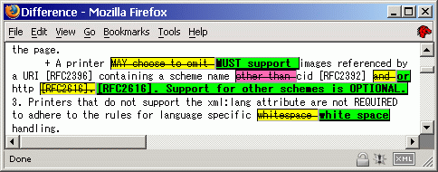

# DocDiff

* [English](README.md) | Japanese

(C) 2000 Hisashi MORITA

## 簡単な説明

2つのテキストファイルを単語ごと、文字ごと、あるいは行ごとに比較する

## スクリーンショット

<div style="display: grid; grid-template-columns: 1fr 1fr;">

<p>HTML output in web browser<br />
</p>

<p>HTML output in web browser (digest)<br />
</p>

<p>tty output in terminal<br />
</p>

<p>tty output in terminal (comparing Japanese text)<br />
</p>

<p>tty output in terminal<br />
</p>

<p>tty output in terminal (comparing Japanese text)<br />
</p>

</div>

<p>Comparing English text (codepage 437) on Windows (Cygwin)<br />
</p>

<p>Comparing Japanese text (codepage 932) on Windows (Cygwin)<br />
</p>

<p>You can compare text files by line, word, or character (format: tty)<br/>
</p>

バージョン0.3.2時点のスクリーンショットです。

## 概要

DocDiffは2つのテキストファイルを比較してその違いを表示します。単語ごと、文字ごと、そして行ごとにファイルを比較できます。結果を出力する形式は、HTML, tty（文字端末向けのエスケープシーケンス）, Manued（真鵺道という校正用のマークアップ形式）などが用意されており、ユーザ定義のタグを使うこともできます。

次のエンコーディング（文字コード）と行末コード（改行文字）をサポートしています: ASCII（およびISO-8859-*などのシングルバイトエンコーディング）, UTF-8, EUC-JP, Shift_JIS、そしてCR, LF, CRLF.

## 使い方

### 概要

```
% docdiff [options] oldfile newfile
```

e.g.

```
% docdiff old.txt new.txt > diff.html
```

詳しくはヘルプメッセージを参照してください（`docdiff --help`）。

### 例

<pre>
% cat sample/01.ja.eucjp.lf
こんにちは、私の名前はわたなべです。
私はJust Another Ruby Porterです。
% cat sample/02.ja.eucjp.lf
こんばんは、私の名前はまつもとです。
Rubyを作ったのは私です。私はRuby Hackerです。
% docdiff sample/01.ja.eucjp.lf sample/02.ja.eucjp.lf
<span class="before-change" style="background: yellow; border: thin inset;"><del>こんにちは</del></span><span class="after-change" style="background: lime; font-weight: bolder; border: thin outset;"><ins>こんばんは</ins></span>、私の<span class="before-change" style="background: yellow; border: thin inset;"><del>名前はわたなべです</del></span><span class="after-change" style="background: lime; font-weight: bolder; border: thin outset;"><ins>名前はまつもとです</ins></span>。
<span class="add" style="background: deepskyblue; font-weight: bolder; border: thin outset;"><ins>Rubyを作ったのは私です。</ins></span>私は<span class="del" style="background: hotpink; border: thin inset;"><del>Just Another </del></span>Ruby <span class="before-change" style="background: yellow; border: thin inset;"><del>Porter</del></span><span class="after-change" style="background: lime; font-weight: bolder; border: thin outset;"><ins>Hacker</ins></span>です。
%
</pre>

## 必要なソフトウェア

* 実行時に必要なソフトウェア:
  - [Ruby](https://www.ruby-lang.org/) (>= 3.0)
* 開発時に必要なソフトウェア:
  - Make ([GNU Make](https://www.gnu.org/software/make/))
  - [Git](https://git-scm.com/)
  - [md2html](https://github.com/mity/md4c)（ドキュメント生成用）
  - [Rake](https://ruby.github.io/rake/)（オプショナル）
  - sed, gzip, tar, etc.

## インストール方法

いくつかのOSでは、DocDiffがパッケージとして提供されていることがあります。そのような場合は、それらのパッケージを使ってインストールするのが早道でしょう。

### Debianパッケージ

サイト単位でのインストール:

```
$ sudo apt update
$ sudo apt install docdiff
```

### Gemパッケージ

Rubyに詳しいならば、gemパッケージとしてDocDiffをインストールしたいと思うかもしれません。

ユーザ単位でのインストール（[RubyGems.org](https://rubygems.org/)から）:

```
$ gem install docdiff
```

ユーザ単位でのインストール（手元でのビルドから）:

```
$ rake build
$ gem install pkg/docdiff-X.Y.Z.gem
```

（注意：Gemとしてインストールしたアプリケーションを起動するには、`PATH`環境変数を適切に設定する必要があります。[rbenv](https://github.com/rbenv/rbenv)などのRuby環境管理ツールを使うと便利かもしれません。）

### Makeを使ってソースからインストールする

やむをえずMakeを使ってソースからDocDiffをインストールするときは、事前によくテストしてください。

`tmp`ディレクトリへのテストインストール:

```
$ mkdir tmp
$ make install DESTDIR=tmp PREFIX=/local
$ tree tmp || la -lR tmp
```

ユーザ単位でのインストールの例（ファイルを上書きしたりディレクトリ構造を汚くしたりしかねないので、おすすめしませんが）:

```
$ make install DESTDIR=~ PREFIX=/local
```

## 設定

設定ファイルは次の場所に配置すると有効になります:

* `/etc/docdiff/docdiff.conf`（サイト全体の設定）
* `~/etc/docdiff/docdiff.conf`（ユーザごとの設定）
  （標準の設定では、ホームディレクトリにドットファイルをまき散らかさないために、`~/etc/docdiff/docdiff.conf`が使われます。または、昔ながらのUnixの慣習に従って`~/.docdiff/docdiff.conf`を使ってももちろん構いません。ただし両方同時には使えません）

設定ファイルの記法は次のとおりです（`docdiff.conf.example`ファイルも参照してください。配布アーカイブに含まれているはずです）:

```
# comment
key1 = value
key2 = value
...
```

値（value）は、数字として解釈できるもの以外は、すべて文字列として扱われます。数字は数値（たいていは整数）として扱われます。

## 問題解決とヒント

### Wrong argument type nil (expected Module) (TypeError)

DocDiffがたまにエンコーディングや行末文字の自動判定に失敗して、次のようなエラーを出力することがあります。

```
charstring.rb:47:in `extend': wrong argument type nil (expected Module) (TypeError)
```

このような場合は、エンコーディングや行末文字を明示的に指定してみてください（e.g. `docdiff --utf8 --crlf`）。

### 不適切な挿入と削除

スペースで区切られたテキスト（英文やプログラムのソースコードなど）を比較しているときに、行末にある単語が、特に必要もないのにいったん削除されてからまた挿入されることがあります。これはDocDiffの単語分割機能に制限があるせいで起きます。テキストは次のように単語に分割されます。

* Text 1:
  ```
  foo bar
  ```
  (`"foo bar"  => ["foo ", "bar"]`)

* Text 2:
  ```
  foo
  bar
  ```
  (`"foo\nbar" => ["foo", "\n", "bar"]`)

* 比較した結果:
  <pre>
  <del>foo </del><ins>foo</ins><ins>
  </ins>bar
  </pre>
  (`"<del>foo </del><ins>foo</ins><ins>\n</ins>bar"`)

Fooは（必要もないのに）削除されると同時に挿入されています。

作者はこの問題をいつか解決したいと思っていますが、簡単ではなさそうです。もし空白を1つの要素として分割したなら（i.e. `["foo", " ", "bar"]`）、比較した結果出力される単語の並びが今よりも不自然になってしまいます。良い案があったら教えてください。

### DocDiffをバージョン管理システムと組み合わせて使う

DocDiffをVCSの外部diffプログラムとして使いたければ、次のようにするとよいでしょう。

* Git:
  ```
  $ GIT_EXTERNAL_DIFF=~/bin/gitdocdiff.sh git diff
  ```
  `~/bin/gitdocdiff.sh`:
  ```
  #!/bin/sh
  docdiff --ascii --lf --tty --digest $2 $5
  ```

* Subversion:
  ```
  $ svn diff --diff-cmd=docdiff --extensions "--ascii --lf --tty --digest"
  ```

（場合によっては`git diff --word-diff-regex="\w"`で十分なこともありますが。）

zshを使えば、いろいろな場所にある文書をDocDiffや他のユーティリティで自由に比較できます。次の例ではリポジトリ内の特定のリビジョンのfoo.htmlとウェブサイト上のfoo.htmlとを比較しています。

* Git:
  ```
  $ docdiff =(git show abc1234:foo.html) =(curl --silent http://www.example.org/foo.html)
  ```

* Subversion:
  ```
  $ docdiff =(svn cat -r3 http://svn.example.org/repos/foo.html) =(curl --silent http://www.example.org/foo.html)
  ```

### プレーンテキストではない文書ファイルを比較する

適切な変換ツールを使えば、プレーンテキスト以外のファイルも比較できる場合があります。

* PDF文書中のテキストを比較する:
  ```
  $ docdiff =(pdftotext foo.pdf -) =(pdftotext bar.pdf -)
  ```

* HTML文書中のテキスト（タグを除く）を比較する:
  ```
  $ docdiff =(w3m -dump -cols 10000 foo.html) =(w3m -dump -cols 10000 http://www.example.org/foo.html)
  ```

* Microsoft Word文書中のテキストを比較する:
  ```
  $ docdiff =(wvWare foo.doc | w3m -T text/html -dump -cols 10000) =(wvWare bar.doc | w3m -T text/html -dump -cols 10000)
  ```

### Latin-* (ISO-8859-*) のための回避策: ASCIIを指定する

文字コードがLatin-* (ISO-8859-*) のテキストを扱うときは、文字コードに`ASCII`を指定してみてください。`ASCII`が指定されると、DocDiffは対象をシングルバイト文字のテキストとして扱います。

* Latin-1テキストを比較する:
  ```
  $ docdiff --encoding=ASCII latin-1-old.txt latin-1-new.txt
  ```

## ライセンス

このソフトウェアはいわゆる修正BSDスタイルライセンス（<http://www.opensource.org/licenses/bsd-license.php>（広告条項なし））のもとで配布されています。このソフトウェアに貢献すると、あなたは貢献したものが同ライセンスのもとに取り込まれることに同意したとみなされます。

ソースコードの主となる部分の著作権と使用条件は次のとおりです:

```
Copyright (C) Hisashi MORITA.  All rights reserved.

Redistribution and use in source and binary forms, with or without
modification, are permitted provided that the following conditions
are met:
1. Redistributions of source code must retain the above copyright
   notice, this list of conditions and the following disclaimer.
2. Redistributions in binary form must reproduce the above copyright
   notice, this list of conditions and the following disclaimer in the
   documentation and/or other materials provided with the distribution.
3. Neither the name of the University nor the names of its contributors
   may be used to endorse or promote products derived from this software
   without specific prior written permission.

THIS SOFTWARE IS PROVIDED BY THE REGENTS AND CONTRIBUTORS ``AS IS'' AND
ANY EXPRESS OR IMPLIED WARRANTIES, INCLUDING, BUT NOT LIMITED TO, THE
IMPLIED WARRANTIES OF MERCHANTABILITY AND FITNESS FOR A PARTICULAR PURPOSE
ARE DISCLAIMED.  IN NO EVENT SHALL THE REGENTS OR CONTRIBUTORS BE LIABLE
FOR ANY DIRECT, INDIRECT, INCIDENTAL, SPECIAL, EXEMPLARY, OR CONSEQUENTIAL
DAMAGES (INCLUDING, BUT NOT LIMITED TO, PROCUREMENT OF SUBSTITUTE GOODS
OR SERVICES; LOSS OF USE, DATA, OR PROFITS; OR BUSINESS INTERRUPTION)
HOWEVER CAUSED AND ON ANY THEORY OF LIABILITY, WHETHER IN CONTRACT, STRICT
LIABILITY, OR TORT (INCLUDING NEGLIGENCE OR OTHERWISE) ARISING IN ANY WAY
OUT OF THE USE OF THIS SOFTWARE, EVEN IF ADVISED OF THE POSSIBILITY OF
SUCH DAMAGE.
```

diffライブラリ（`docdiff/diff.rb`および`docdiff/diff/*`）は、もともと田中哲さんによるRuby/CVSの一部分でした。Ruby/CVSは修正BSDスタイルライセンスのもとで配布されています。詳細は次を参照してください。

* <http://raa.ruby-lang.org/list.rhtml?name=ruby-cvs>
* <http://cvs.m17n.org/~akr/ruby-cvs/>

## クレジット

* Hisashi MORITA (primary author)

## 謝辞

* Akira TANAKA (diff library author)
* Shin'ichiro HARA (initial idea and algorithm suggestion)
* Masatoshi SEKI (patch)
* Akira YAMADA (patch, Debian package)
* Kenshi MUTO (testing, bug report, Debian package)
* Kazuhiro NISHIYAMA (bug report)
* Hiroshi OHKUBO (bug report)
* Shugo MAEDA (bug report)
* Kazuhiko (patch)
* Shintaro Kakutani (patches)
* Masayoshi Takahashi (patches)
* Masakazu Takahashi (patch)
* Hibariya (bug report)
* Hiroshi SHIBATA (patch)
* Tamotsu Takahashi (patches)
* MIKAMI Yoshiyuki (patch)

このリストが全く不完全で、いろいろな形で貢献してくださった多くの方々へ謝意を表しそこねていることをお詫びします。本当にありがとうございます。

## 情報源

### フォーマット

* [HTML/XHTML](http://www.w3.org)
* tty (Graphic rendition using VT100 / ANSI escape sequence)
  - [VT100](http://vt100.net/docs/tp83/appendixb.html)
  - [ANSI](http://www.tldp.org/HOWTO/Bash-Prompt-HOWTO/x329.html)
* [Manued](http://www.archi.is.tohoku.ac.jp/~yamauchi/otherprojects/manued/index.shtml) (Manuscript Editing language: a proofreading method for text)

### 同様の目的を持ったソフトウェア

テキストを単語単位や文字単位で比較することができるソフトウェアは、ほかにもあります。

* [GNU wdiff](http://www.gnu.org/directory/GNU/wdiff.html) (Seems to support single byte characters only.)
* [cdif](http://srekcah.org/~utashiro/perl/scripts/cdif) by Kazumasa UTASHIRO (Supports several Japanese encodings.)
* [ediff](http://www.xemacs.org/Documentation/packages/html/ediff.html) for Emacsen
* [diff-detail](http://ohkubo.s53.xrea.com/xyzzy/index.html#diff-detail) for xyzzy, by Hiroshi OHKUBO
* [Manuediff](http://hibiki.miyagi-ct.ac.jp/~suzuki/comp/export/manuediff.html) (Outputs difference in Manued format.)
* [YASDiff](http://nnri.dip.jp/~yf/cgi-bin/yaswiki2.cgi?name=YASDiff&parentid=0) (Yet Another Scheme powered diff) by Y. Fujisawa
* [WinMerge](http://winmerge.org/) (GUI diff tool for Windows)
